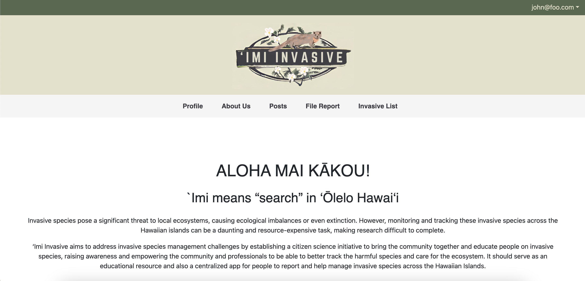
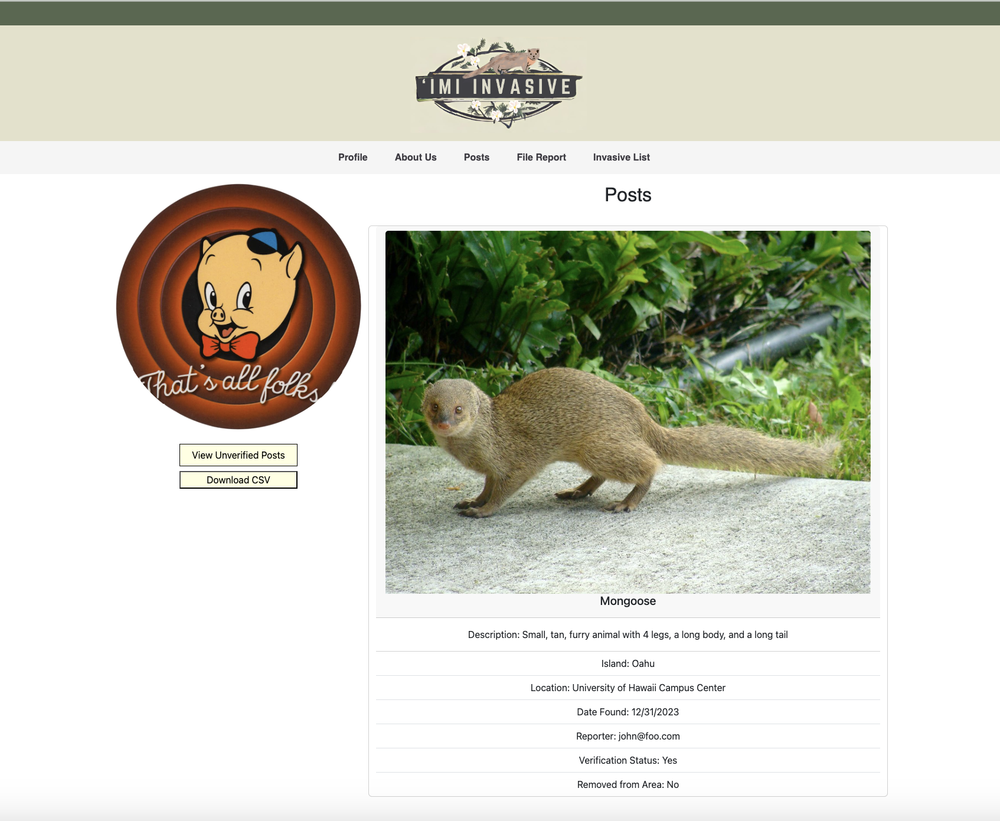
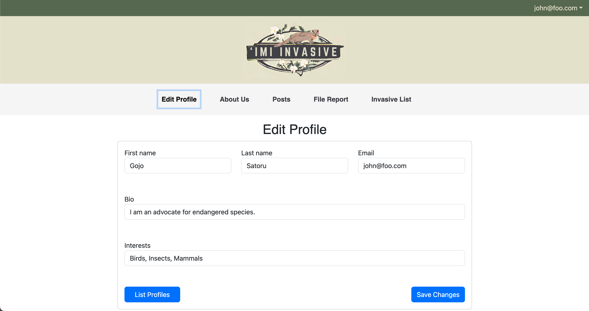
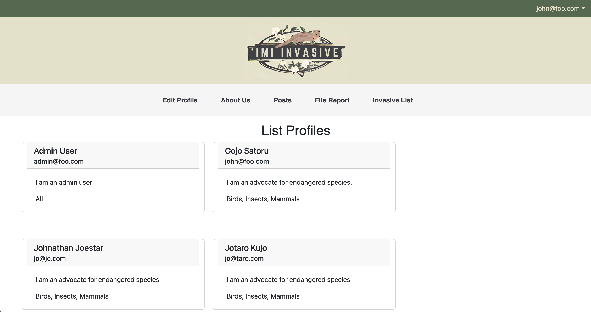
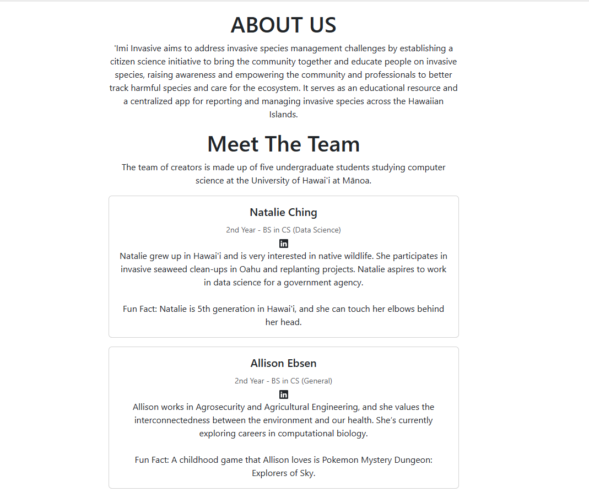
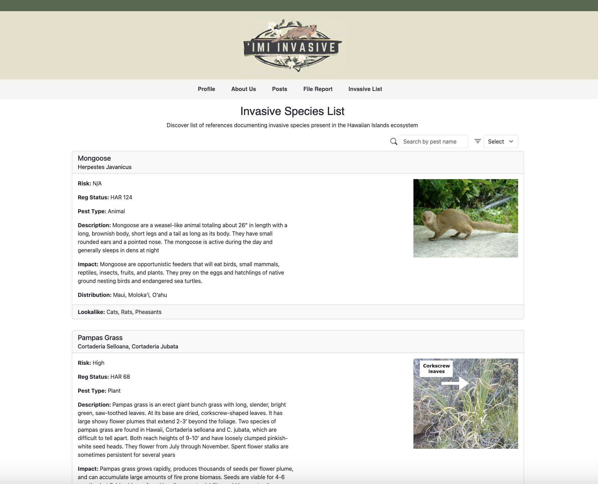
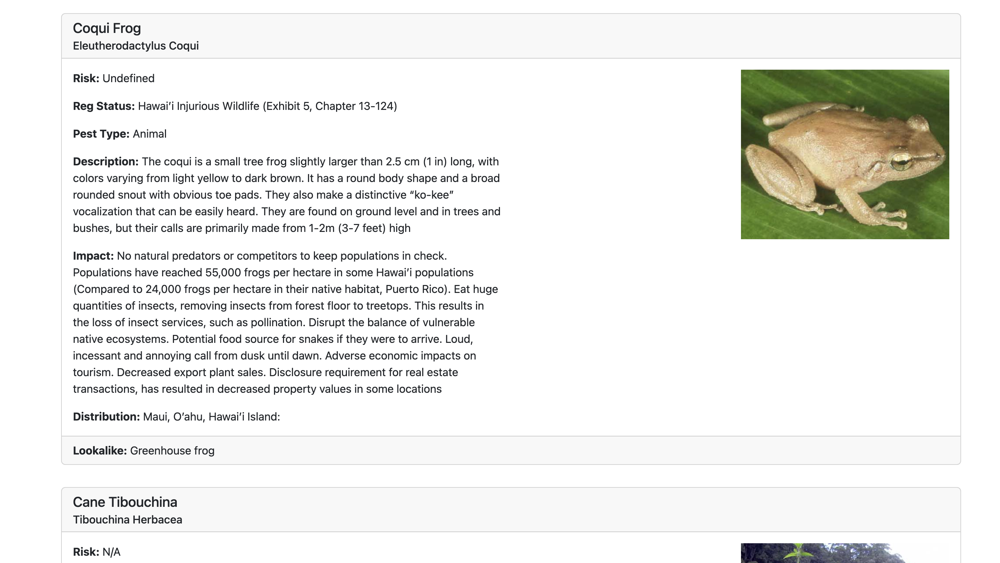

# Island Invaders

## Members

* [Natalie Ching](#natalie-ching)
* [Allison Ebsen](#allison-ebsen)
* [Lily Enanoria](#lily-enanoria)
* [Myra Ortigosa](#myra-ortigosa)
* [Gian Panoy](#gian-panoy)

## Table of contents

* [Overview](#overview)
* [Users](#users)
* [Deployment](#deployment)
* [User Guide](#user-guide)
* [Beyond Basics](#beyond-basics-possibly-ambitious)
* [Developer Guide](#developer-guide)
* [Continuous Integration](#continuous-integration)
* [Development History](#development-history)
* [About the Team](#about-the-team)

## Overview

### Problem:
Invasive species pose a significant threat to local ecosystems, causing ecological imbalances or even extinction. However, monitoring and tracking these invasive species across the Hawaiian islands can be a daunting and resource-expensive task, making research difficult to complete.

### Solution:
‘Imi Invasive aims to address invasive species management challenges by establishing a citizen science initiative to bring the community together and educate people on invasive species, raising awareness and empowering the community and professionals to be able to better track the harmful species and care for the ecosystem. It should serve as an educational resource and also a centralized app for people to report and help manage invasive species across the Hawaiian Islands.

## Users
- Scientific Community
- Organizations That Manage Invasive Species
- General Public

### Example Users:
- A visiting tourist goes on a hike and finds an unfamiliar plant while on a trail, using the app to identify and report a potential invasive species sighting.
- Educators and students can use the app to actively engage with and learn more about the local ecology and caring for our ecosystem, engaging students in real-world science and environmental stewardship in their own backyards.
  <br/>
- A local conservation organization can utilize app data to coordinate and organize community events to remove invasive species and track progress.
- Researchers studying invasive species trends can analyze data collected from the platform to identify potential problems and prioritize management efforts and investment.

## Deployment
Here is our deployed application running on [Digital Ocean](http://64.23.200.75/).

## User Guide
This section provides a walkthrough of the ‘Imi Invasive user interface and its capabilities.

### Landing Page
The landing page is presented to users when they visit the top-level URL to the site. It welcomes users and provide an overview of the project and goals.

Click on the “Login” button in the upper right corner of the navbar, then select “Sign in” to go to the following page and login. You will have an option to select "Sign Up" and register as a new user.



### Posts Page
After clicking "Posts" in the navigation bar, the Posts page displays the verified invasive species reports made by the community. Click on the toggle button to switch between viewing verified posts and only posts created by the user. Click on the download button to download a csv file of all verified reports made by users on the site.



### Edit Profile Page
After clicking "Edit Profiles" in the navigation bar, users are taken to the Profiles page. This presents a view only profile which the user can see their profile data such as first name, last name, email, biography, and interests.  There are two buttons: "List Profiles" and "Save Changes" also a "Save Changes". The "Save Changes" button allows users to save any changes made. The "List Profiles Button" allows you to view all profiles.



### List Profiles Page
After clicking the "List Profiles" button, users are taken to the List Profiles page. This page displays all the profiles of users who have signed up for the app.



### About Us Page
After clicking "About Us" in the navigation bar, users are taken to the About Us page which provides information about the team and the project's overall message.



### Educational Resources Page
After clicking "Educational Resources" in the navigation bar, users are taken to the Educational Resources page which provides carefully curated content such as articles, videos, or infographics to help educate users about invasive species. The page also displays a 'Imi Invasives' Database of Known Invasive Species which is an organized database of invasive species, including information such as identification tips, distribution maps, ecological impacts





## Beyond Basics (Possibly Ambitious)
- Make data entries exportable as an Excel Spreadsheet (csv) so that researchers can easily work with the data
- Further gamify it
- Explore the use of machine learning algorithms to improve species identification accuracy and efficiency AND/OR assess the effectiveness of implemented strategies or suggest other plans of action
- Integrate with GIS or other map visualization

## Developer Guide

This section provides information of interest to Meteor developers wishing to use this code base as a basis for their own development tasks.

### Installation

First, [install Meteor](https://www.meteor.com/install).

Second, visit the [Island Invaders application github page](https://github.com/islandinvaders/imi-invasive), and click the "Use this template" button to create your own repository initialized with a copy of this application. Alternatively, you can download the sources as a zip file or make a fork of the repo.  However you do it, download a copy of the repo to your local computer.

Third, cd into the imi-invasive/app directory and install libraries with:

```
$ meteor npm install
```

Fourth, run the system with:

```
$ meteor npm run start
```

If all goes well, the application will appear at [http://localhost:3000](http://localhost:3000).

### Application Design

'Imi Invasive is based upon [meteor-application-template-react](https://ics-software-engineering.github.io/meteor-application-template-react/) and [meteor-example-form-react](https://ics-software-engineering.github.io/meteor-example-form-react/). Please use the videos and documentation at those sites to better acquaint yourself with the basic application design and form processing in 'Imi Invasive.

### Quality Assurance

#### ESLint

'Imi Invasive includes a [.eslintrc](https://github.com/islandinvaders/imi-invasive/blob/main/app/.eslintrc.js) file to define the coding style adhered to in this application. You can invoke ESLint from the command line as follows:

```
meteor npm run lint
```

Here is sample output indicating that no ESLint errors were detected:

```
PS C:\Users\Lily\Desktop\ICS_UHMAN\ICS314\GitHub\imi-invasive\app> npm run lint 

> meteor-application-template-react@ lint C:\Users\Lily\Desktop\ICS_UHMAN\ICS314\GitHub\imi-invasive\app
> eslint --quiet --ext .jsx --ext .js ./imports && eslint --quiet --ext .js ./tests   

PS C:\Users\Lily\Desktop\ICS_UHMAN\ICS314\GitHub\imi-invasive\app> 

```

ESLint should run without generating any errors.

It's significantly easier to do development with ESLint integrated directly into your IDE (such as IntelliJ).

#### End to End Testing

'Imi Invasive uses [TestCafe](https://devexpress.github.io/testcafe/) to provide automated end-to-end testing.

The 'Imi Invasive end-to-end test code employs the page object model design pattern.  In the [imi-invasive tests/ directory](https://github.com/islandinvaders/imi-invasive/tree/main/app/tests), the file [tests.testcafe.js](https://github.com/islandinvaders/imi-invasive/tree/main/app/tests/tests.testcafe.js) contains the TestCafe test definitions. The remaining files in the directory contain "page object models" for the various pages in the system (i.e. Home, Landing, Interests, etc.) as well as one component (navbar). This organization makes the test code shorter, easier to understand, and easier to debug.

To run the end-to-end tests in development mode, you must first start up a ‘Imi Invasive instance by invoking `meteor npm run start` in one console window.

Then, in another console window, start up the end-to-end tests with:

```
meteor npm run testcafe
```

You will see browser windows appear and disappear as the tests run.

## From mockup to production

‘Imi Invasive is meant to illustrate the use of Meteor for developing an initial proof-of-concept prototype.  For a production application, several additional security-related changes must be implemented:

* Use of email-based password specification for users, and/or use of an alternative authentication mechanism.
* Use of https so that passwords are sent in encrypted format.
* Removal of the insecure package, and the addition of Meteor Methods to replace client-side DB updates.

(Note that these changes do not need to be implemented for ICS 314, although they are relatively straightforward to accomplish.)

## Continuous Integration


‘Imi Invasive uses [GitHub Actions](https://docs.github.com/en/free-pro-team@latest/actions) to automatically run ESLint and TestCafe each time a commit is made to the default branch.  You can see the results of all recent "workflows" at [https://github.com/islandinvaders/imi-invasive/actions](https://github.com/islandinvaders/imi-invasive/actions).

The workflow definition file is quite simple and is located at
[.github/workflows/ci.yml](https://github.com/islandinvaders/imi-invasive/blob/main/.github/workflows/ci.yml).

## Development History
This project is developed in a series of milestones:

- [M1](https://github.com/orgs/islandinvaders/projects/2) (completed)
- [M2](https://github.com/orgs/islandinvaders/projects/3) (completed)
- [M3](https://github.com/orgs/islandinvaders/projects/6) (in progress)

## About the Team

The team is made up of five computer science undergraduate students at the University of Hawai'i at Mānoa.
### [Natalie Ching](https://www.linkedin.com/in/natalie-ching-96749a253/)
#### 2nd Year BS in CS Data Science
Natalie grew up in Hawai’i and is very interested in the native wildlife. She also does invasive seaweed clean-ups in Oahu and replanting projects. Natalie wants to work in data science for a government agency.

Fun Fact: Natalie is 5th generation in Hawai’i, and she can touch her elbows behind her head.


### [Allison Ebsen](https://www.linkedin.com/in/allison-ebsen/)
#### 2nd Year BS in CS General

Allison works in Agrosecurity and Agricultural Engineering, and she values the interconnectedness between the environment and our health. She’s currently exploring careers in computational biology.

Fun Fact: A childhood game that Allison loves is Pokemon Mystery Dungeon: Explorers of Sky.


### [Lily Enanoria](https://www.linkedin.com/in/lily-enanoria-0944aa2aa/)
#### 2nd Year BS in CS Security Science
Lily grew up going to the beach with her ‘ohana, and she loves interacting with nature. She loves opportunities to restore the ʻāina. Lily aspires to work in cybersecurity for the government.

Fun Fact: Lily’s goal is to live in Japan one day.


### [Myra Ortigosa](https://www.linkedin.com/in/myra-angelica-ortigosa-5661a4275/)
#### 2nd Year BS in CS Data Science
Myra cares about the environment and engages in community beach clean-ups, and she aspires to become a data scientist or data analyst.

Fun Fact: Myra recently got a takoyaki machine and wants to use it one day when she's not busy.


### [Gian Panoy](https://www.linkedin.com/in/gianpanoy/)
#### 2nd Year BS in CS General
Gian is pursuing a career in software engineering. He is of Native Hawaiian descent and cares about the community and life here.

Fun Fact: Gian (aka Mr. Worldwide) has visited Canada, South Korea, and the Philippines.

[Team Contract](https://docs.google.com/document/d/10awsj1BGBtRuBudM55MgN057PxomPFo33-s55Cq8MKY/edit?usp=sharing)
