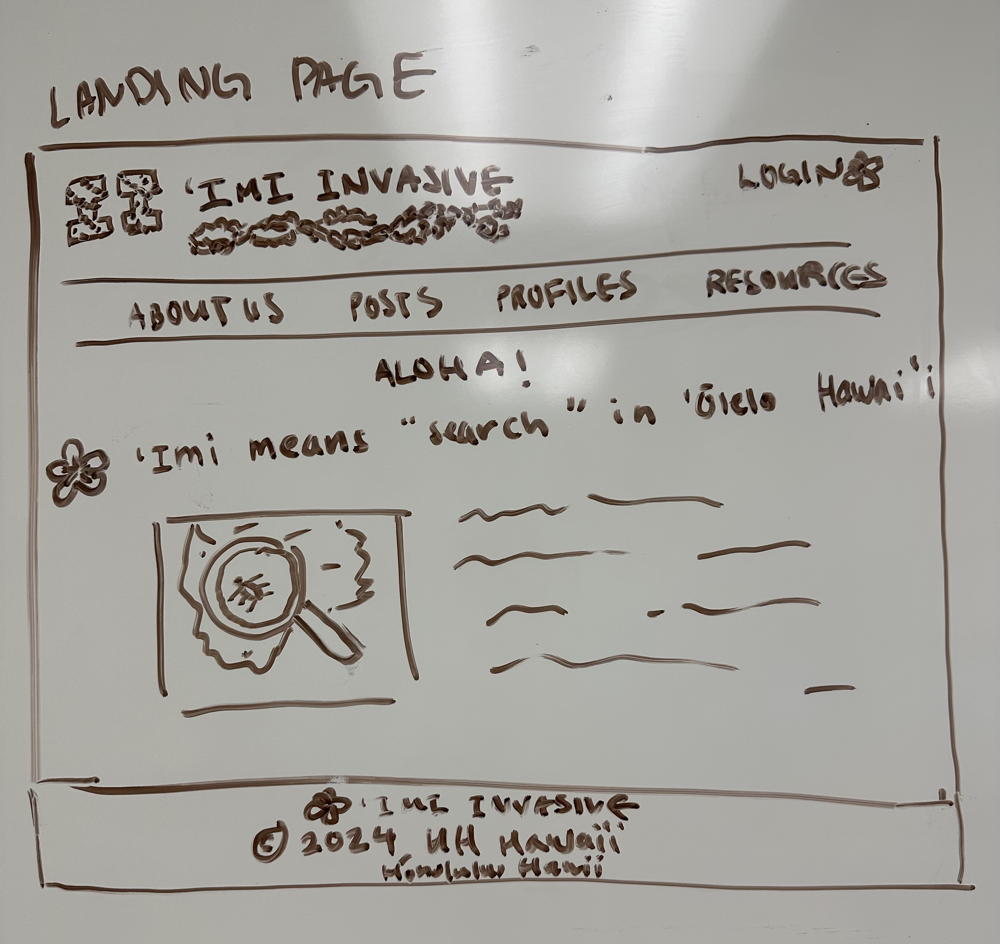
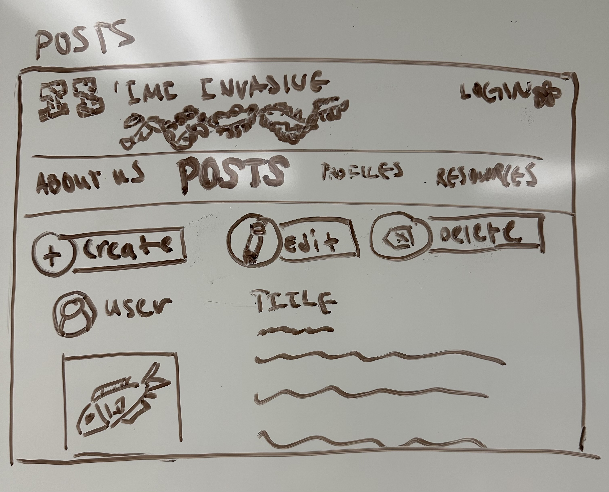
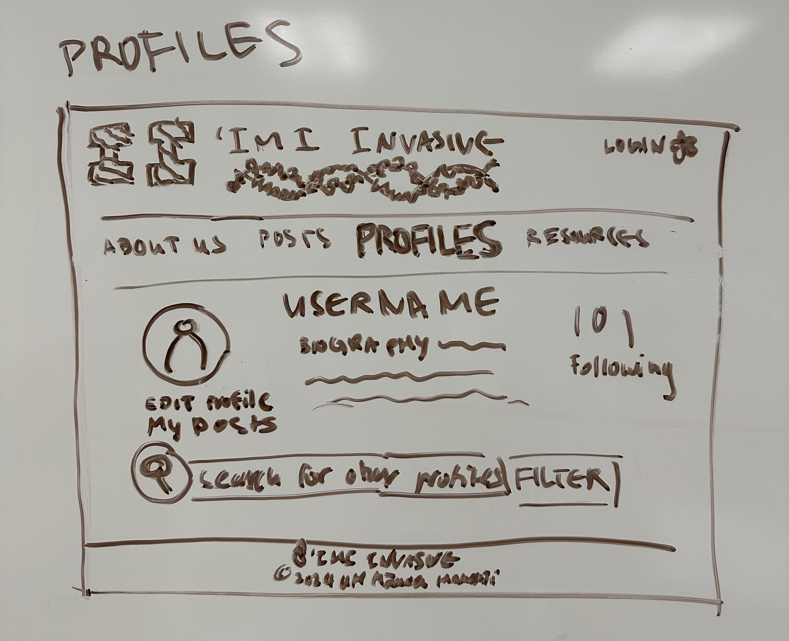
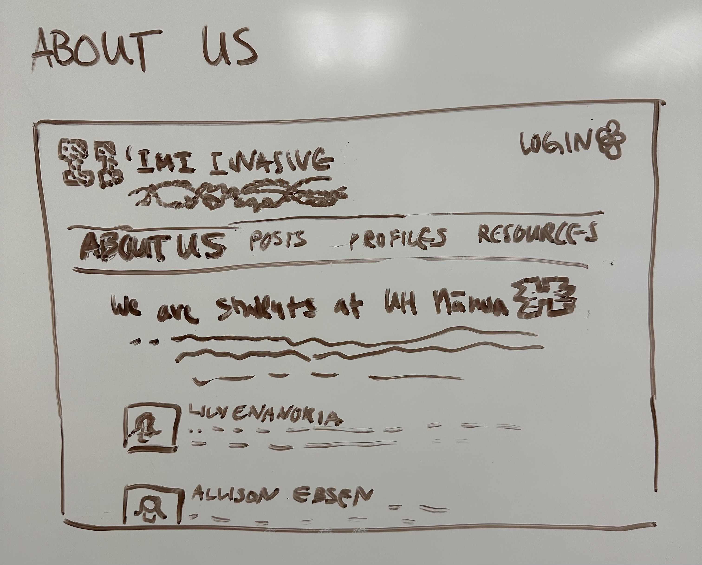
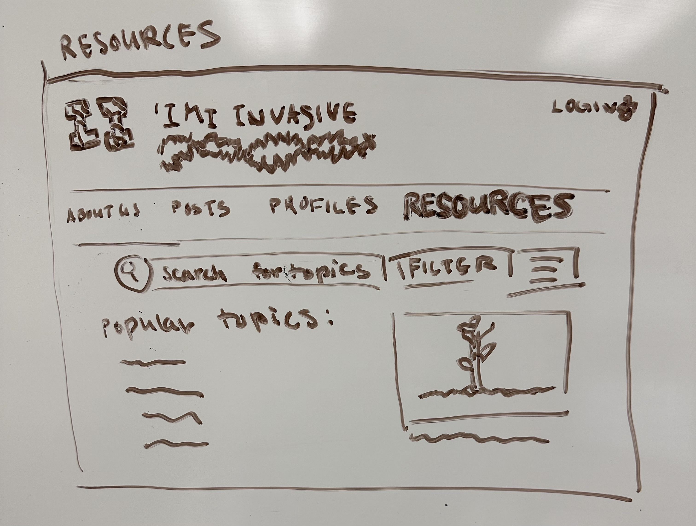

# Island Invaders

## Members

* [Natalie Ching](#natalie-ching)
* [Allison Ebsen](#allison-ebsen)
* [Lily Enanoria](#lily-enanoria)
* [Myra Ortigosa](#myra-ortigosa)
* [Gian Panoy](#gian-panoy)

## Table of contents

* [Overview](#overview)
* [Users](#users)
* [Pages](#pages)
* [Beyond Basics](#beyond-basics-possibly-ambitious)
* [Development History](#development-history)
* [About the Team](#about-the-team)

## Overview

### Problem:
Invasive species pose a significant threat to local ecosystems, causing ecological imbalances or even extinction. However, monitoring and tracking these invasive species across the Hawaiian islands can be a daunting and resource-expensive task, making research difficult to complete.

### Solution:
‘Imi Invasive aims to address invasive species management challenges by establishing a citizen science initiative to bring the community together and educate people on invasive species, raising awareness and empowering the community and professionals to be able to better track the harmful species and care for the ecosystem. It should serve as an educational resource and also a centralized app for people to report and help manage invasive species across the Hawaiian Islands.

## Users
- Scientific Community
- Organizations That Manage Invasive Species
- General Public
  
### Example Users:
- A visiting tourist goes on a hike and finds an unfamiliar plant while on a trail, using the app to identify and report a potential invasive species sighting.
- Educators and students can use the app to actively engage with and learn more about the local ecology and caring for our ecosystem, engaging students in real-world science and environmental stewardship in their own backyards.
 
- A local conservation organization can utilize app data to coordinate and organize community events to remove invasive species and track progress.
- Researchers studying invasive species trends can analyze data collected from the platform to identify potential problems and prioritize management efforts and investment.

## Pages
### Landing Page
- Welcome users and provide an overview of the project and its goals

  - Login/Sign Up

### Posts Page
- Discussion board for users

  - Picture/Entries Upload (example: Photo, Date, Species, Location and Island): Users can upload and create data entries
  - Edit Entries (example: modify information, indicate whether the organism has been removed)
### Profile/Badges Page
- Collect badges or virtual critters for quality contributions, see stats to check your positive impact

### About Us Page
- Information about the team and our overall message

### Educational Resources Page
- Carefully curated content such as articles, videos, or infographics to help educate users about invasive species

  - Database of Known Invasive Species: An organized database of invasive species, including information such as identification tips, distribution maps, ecological impacts

## Beyond Basics (Possibly Ambitious)
- Make data entries exportable as an Excel Spreadsheet (csv) so that researchers can easily work with the data
- Further gamify it
- Explore the use of machine learning algorithms to improve species identification accuracy and efficiency AND/OR assess the effectiveness of implemented strategies or suggest other plans of action
- Integrate with GIS or other map visualization

## Development History
This project is developed in a series of milestones:

- [M1](https://github.com/orgs/islandinvaders/projects/2)

## About the Team

The team is made up of five computer science undergraduate students at the University of Hawai'i at Mānoa.
### [Natalie Ching](https://www.linkedin.com/in/natalie-ching-96749a253/)
#### 2nd Year BS in CS Data Science
Natalie grew up in Hawai’i and is very interested in the native wildlife. She also does invasive seaweed clean-ups in Oahu and replanting projects. Natalie wants to work in data science for a government agency.

Fun Fact: Natalie is 5th generation in Hawai’i, and she can touch her elbows behind her head.

### [Allison Ebsen](https://www.linkedin.com/in/allison-ebsen/)
#### 2nd Year BS in CS General

Allison works in Agrosecurity and Agricultural Engineering, and she values the interconnectedness between the environment and our health. She’s currently exploring careers in computational biology.

Fun Fact: A childhood game that Allison loves is Pokemon Mystery Dungeon: Explorers of Sky.

### [Lily Enanoria](https://www.linkedin.com/in/lily-enanoria-0944aa2aa/)
#### 2nd Year BS in CS Security Science
Lily grew up going to the beach with her ‘ohana, and she loves interacting with nature. She loves opportunities to restore the ʻāina. Lily aspires to work in cybersecurity for the government.

Fun Fact: Lily’s goal is to live in Japan one day.

### [Myra Ortigosa](https://www.linkedin.com/in/myra-angelica-ortigosa-5661a4275/)
#### 2nd Year BS in CS Data Science
Myra cares about the environment and engages in community beach clean-ups, and she aspires to become a data scientist or data analyst.

Fun Fact: Myra recently got a takoyaki machine and wants to use it one day when she's not busy.

### [Gian Panoy](https://www.linkedin.com/in/gianpanoy/)
#### 2nd Year BS in CS General
Gian is pursuing a career in software engineering. He is of Native Hawaiian descent and cares about the community and life here.

Fun Fact: Gian (aka Mr. Worldwide) has visited Canada, South Korea, and the Philippines.

[Team Contract](https://docs.google.com/document/d/10awsj1BGBtRuBudM55MgN057PxomPFo33-s55Cq8MKY/edit?usp=sharing)